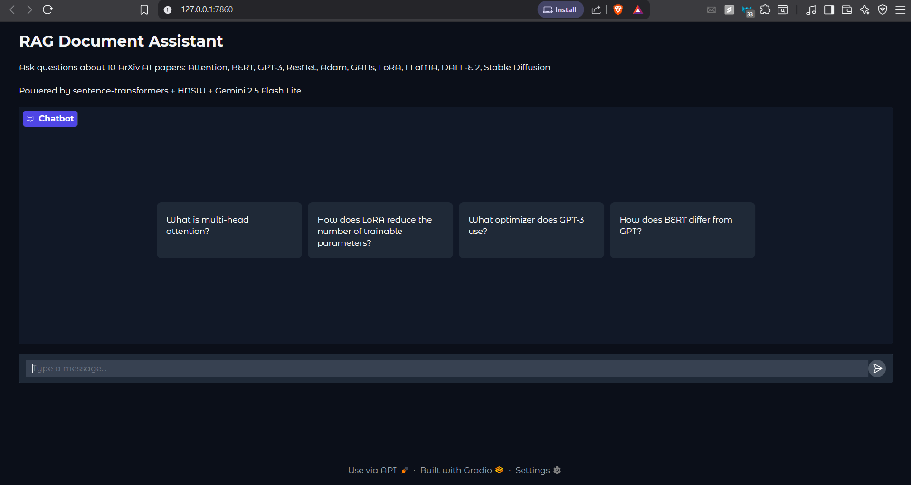
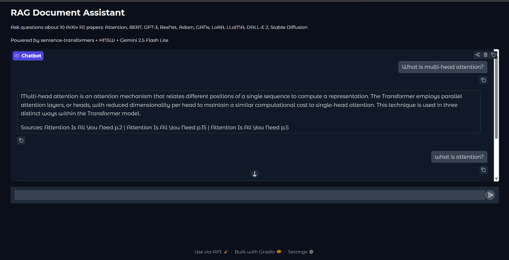
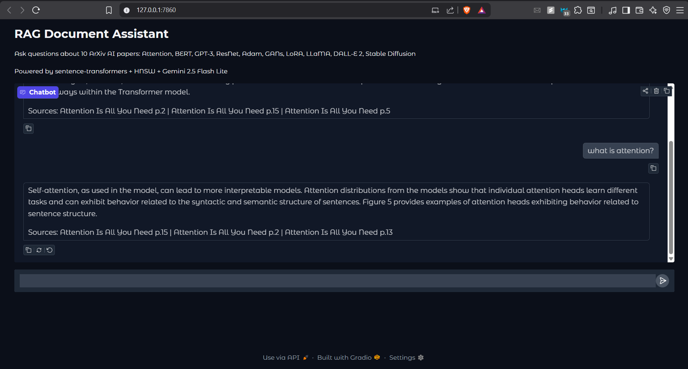

# RAG Document Assistant

> Production-grade Retrieval-Augmented Generation pipeline over ArXiv AI papers.
> Evaluates **3 chunking strategies x 2 index types x 2 embedding models x 3 top-k values** — 36+ experiment runs tracked via W&B Sweeps on ASU Sol HPC (A100 GPU).
> Live chat interface powered by Gemini 2.5 Flash Lite API.

[](https://wandb.ai/ngangada-arizona-state-university/rag-document-assistant)
[](https://python.org)
[](https://ai.google.dev)
[](LICENSE)

---

## Live Demo

The chat interface runs locally via Gradio. Ask questions about 10 ArXiv AI papers
and get answers with source citations including page numbers.

**Chat Interface — question suggestions and multi-turn support:**



**Answering "What is multi-head attention?" — retrieved from the Attention paper with page citations:**



**Multi-turn conversation — follow-up question "what is attention?" answered with different context:**



---

## Architecture

```
PRE-PRODUCTION (runs on ASU Sol HPC — A100 GPU)
================================================

  PDF Papers
      |
      v
  Chunker (5 strategies)          Embedding Model (2 options)
  - Fixed size (512 chars)   -->  - all-MiniLM-L6-v2 (384 dim)
  - Sentence (5 sent/chunk)       - BAAI/bge-small-en-v1.5
  - Paragraph (recursive)
  - Semantic (cosine split)       Vector Database (3 options)
  - Hybrid (Docling layout)  -->  - ChromaDB Flat (brute-force)
                                  - HNSW (hnswlib, graph-based)
                                  - FAISS-IVF (approximate)

  All combinations tracked via W&B Sweeps (36+ runs)


IN PRODUCTION (runs locally — no GPU needed)
============================================

  User Question
       |
       v
  Embedding Model (sentence-transformers)
       |
       v
  HNSW Vector Search --> Top-5 Chunks (with page numbers)
       |
       v
  Gemini 2.5 Flash Lite API
       |
       v
  Answer + Source Citations

  Live at: http://127.0.0.1:7860 (Gradio UI)
  API at:  http://127.0.0.1:8000 (FastAPI)
```

---

## Quickstart — Run the Chat

### Option A: Run locally (fastest, no Docker needed)

```bash
# Step 1 — Clone the repo
git clone https://github.com/YOUR_USERNAME/rag-document-assistant
cd rag-document-assistant

# Step 2 — Install dependencies
# This installs all Python packages needed for the chat UI
pip install -r requirements_docker.txt

# Step 3 — Set your Gemini API key
# Get a free key at: https://aistudio.google.com/apikey
# On Mac/Linux:
export GEMINI_API_KEY=AIza...your-key-here...
# On Windows PowerShell:
$env:GEMINI_API_KEY = "AIza...your-key-here..."

# Step 4 — Download the pre-built chunks (or build yourself — see below)
# The chunks_paragraph.json file contains 1,983 pre-processed text chunks
# from 10 ArXiv papers. Download from releases or build yourself.

# Step 5 — Start the chat
python app/chat.py

# Step 6 — Open your browser
# http://127.0.0.1:7860
```

### Option B: Run with Docker

```bash
# Step 1 — Clone the repo
git clone https://github.com/YOUR_USERNAME/rag-document-assistant
cd rag-document-assistant

# Step 2 — Create your .env file with API keys
cp .env.example .env
# Open .env and add:
#   GEMINI_API_KEY=AIza...your-key...
#   WANDB_API_KEY=wandb_v1_...your-key...

# Step 3 — Build the Docker image
# This downloads Python, installs all packages (~3-5 minutes first time)
docker compose build

# Step 4 — Start the chat service
# Starts Gradio UI at http://localhost:7860
docker compose up chat

# Optional: start everything (chat + API server)
docker compose up

# Stop everything
docker compose down
```

---

## Adding New PDF Papers

To add your own PDFs and have the system index them:

### Step 1 — Drop your PDF into the folder

```
data/raw/pdfs/your_paper.pdf
```

Any PDF works — research papers, textbooks, documentation.

### Step 2 — Re-run ingestion

```bash
# This reads all PDFs in data/raw/pdfs/ and creates searchable chunks
# --method paragraph uses recursive splitting (best quality, recommended)
python scripts/run_ingest.py --method paragraph

# What this command does:
# 1. Reads every .pdf file in data/raw/pdfs/
# 2. Extracts text page by page using pypdf (no GPU needed)
# 3. Splits text into 512-character overlapping chunks
# 4. Saves chunks to data/processed/chunks_paragraph.json
# 5. Logs chunk count, avg size, ingestion speed to W&B

# Other chunking options:
python scripts/run_ingest.py --method fixed      # fixed 512-char windows
python scripts/run_ingest.py --method sentence   # 5 sentences per chunk
python scripts/run_ingest.py --method semantic   # groups by meaning (GPU recommended)
python scripts/run_ingest.py --method hybrid     # Docling layout-aware (best for tables/figures)
```

### Step 3 — Restart the chat

```bash
# Local:
python app/chat.py

# Docker:
docker compose restart chat
```

The new paper is now searchable. Ask questions about it in the chat.

### Step 4 — Run the W&B sweep to find optimal settings (optional)

```bash
# This tests all chunking x indexing combinations and logs to W&B
# Shows which configuration gives best retrieval for your corpus
wandb sweep configs/sweep.yaml
wandb agent ngangada-arizona-state-university/rag-document-assistant/SWEEP_ID
```

---

## All Commands Explained

### Data Commands

```bash
# Download all 10 ArXiv papers automatically
# Fetches PDFs from arxiv.org, saves to data/raw/pdfs/
# Also downloads HuggingFace eval dataset to data/raw/hf_dataset/
python scripts/download_data.py

# Ingest PDFs with a specific chunking method
# Reads: data/raw/pdfs/*.pdf
# Writes: data/processed/chunks_{method}.json
# Logs: chunk stats to W&B (total chunks, avg size, speed)
python scripts/run_ingest.py --method paragraph

# Ingest with custom chunk size (default: 512 chars)
python scripts/run_ingest.py --method paragraph --chunk-size 1024

# Ingest all methods at once
python scripts/run_ingest.py --method all

# Generate eval Q&A pairs from your chunks using Gemini
# Reads: chunks_paragraph.json
# Writes: data/eval/qa_pairs_arxiv.json (60 question-answer pairs)
# Used for: measuring retrieval quality
python scripts/generate_eval.py \
    --chunks-path data/processed/chunks_paragraph.json \
    --out-path data/eval/qa_pairs_arxiv.json \
    --n-questions 60
```

### Evaluation Commands

```bash
# Self-retrieval test (no API needed, no GPU needed)
# Tests whether each chunk can retrieve itself
# Runs in ~42 seconds, logs results to W&B
# Output: data/eval/self_retrieval_results.json
python scripts/run_eval.py --all --top-k 10

# Evaluate a specific combination
python scripts/run_eval.py --method paragraph --index hnsw --top-k 10

# Run the full W&B sweep (tests all combinations)
# Creates 36+ experiment runs comparing chunking x indexing x embedding x top-k
wandb sweep configs/sweep.yaml
wandb agent YOUR_ENTITY/rag-document-assistant/SWEEP_ID
```

### Query Commands

```bash
# Interactive CLI — ask questions in the terminal
# Uses: chunks_paragraph.json + HNSW index
# No browser needed, good for quick testing
python scripts/run_query.py --method paragraph --index hnsw

# Ask a single question non-interactively
python scripts/run_query.py \
    --method paragraph \
    --index hnsw \
    --question "What is multi-head attention?"
```

### Server Commands

```bash
# Start the Gradio chat UI
# Opens at: http://127.0.0.1:7860
# Requires: GEMINI_API_KEY set in environment
python app/chat.py

# Start the FastAPI backend
# API docs at: http://127.0.0.1:8000/docs
# Health check: http://127.0.0.1:8000/health
# Query endpoint: POST http://127.0.0.1:8000/query
uvicorn api.main:app --reload --port 8000

# Start both with Docker
docker compose up
```

### Docker Commands

```bash
# Build the Docker image (run after changing requirements_docker.txt)
# Downloads Python + installs all packages (~3-5 minutes)
docker compose build

# Build without using cache (use when build seems stuck on old version)
docker compose build --no-cache

# Start the chat UI at http://localhost:7860
docker compose up chat

# Start everything (chat + API)
docker compose up

# Start in background (detached mode)
docker compose up -d chat

# See what is currently running
docker compose ps

# See live logs from the chat container
docker compose logs -f chat

# Stop all running services
docker compose down

# Get a shell inside the container for debugging
docker compose exec chat bash

# Remove all stopped containers and free disk space
docker system prune -f
```

### Ingest + Eval + Sweep on Your PC

These scripts replace HPC cluster jobs and run entirely on CPU.
No GPU needed. Works on Windows, Mac, and Linux.

```bash
# Run all chunking methods in one command
# Reads all PDFs in data/raw/pdfs/
# Saves chunks to data/processed/chunks_{method}.json
# Logs chunk stats to W&B
# Skips semantic/hybrid by default (slow on CPU, add --all to include)
python scripts/run_all_ingest.py

# Run specific methods only
python scripts/run_all_ingest.py --methods fixed paragraph

# Run without W&B logging
python scripts/run_all_ingest.py --no-wandb
```

```bash
# Run self-retrieval evaluation across all methods
# No API key needed, no GPU needed
# Tests whether each chunk retrieves itself in top-k results
# Logs hit rate and latency comparison table to W&B
# Saves results to data/eval/self_retrieval_results.json
python scripts/run_eval_local.py

# Evaluate with top-k=5 instead of default 10
python scripts/run_eval_local.py --top-k 5
```

```bash
# Run W&B sweep to find best chunking + indexing combination
# Creates a new sweep from configs/sweep.yaml
# Tests all combinations: chunking x indexing x embedding x top_k
# View results at: https://wandb.ai/YOUR_ENTITY/rag-document-assistant

# Quick test — run only 6 combinations first
python scripts/run_sweep_local.py --count 6

# Full sweep — all 36+ combinations (takes 2-3 hours on CPU)
python scripts/run_sweep_local.py

# Continue an existing sweep
python scripts/run_sweep_local.py --sweep-id YOUR_SWEEP_ID
```

---

## Experiment Results

### Test 1: Cross-Corpus Retrieval (W&B Sweep — 36+ runs)

| Chunking | Index | Embedding Model | top_k | Context Hit Rate | Latency (ms) |
|----------|-------|----------------|-------|-----------------|-------------|
| **paragraph** | **HNSW** | **bge-small-en-v1.5** | **10** | **0.87** | **16.3** |
| paragraph | HNSW | bge-small-en-v1.5 | 5 | 0.86 | 15.9 |
| paragraph | HNSW | all-MiniLM-L6-v2 | 10 | 0.86 | 14.0 |
| paragraph | flat | all-MiniLM-L6-v2 | 10 | 0.85 | 30.2 |
| fixed | HNSW | all-MiniLM-L6-v2 | 10 | 0.60 | 14.3 |
| sentence | HNSW | all-MiniLM-L6-v2 | 10 | 0.54 | 12.5 |

> Anomaly: bge-small-en-v1.5 + ChromaDB flat collapsed to 0.02-0.16 hit rate
> due to embedding normalization mismatch. bge + HNSW worked correctly (0.81-0.87).

### Test 2: Self-Retrieval Sanity Check (42 seconds, no API needed)

| Chunking | Index | top_k | Hit Rate | Latency (ms) |
|----------|-------|-------|----------|-------------|
| fixed | flat | 10 | 1.000 | 12.5 |
| fixed | HNSW | 10 | 1.000 | 5.9 |
| sentence | HNSW | 10 | 1.000 | 5.7 |
| paragraph | flat | 10 | 1.000 | 13.6 |
| paragraph | HNSW | 10 | 0.990 | 5.7 |

HNSW is consistently 2x faster than flat search (5-6ms vs 11-14ms).

---

## Key Findings

**1. Paragraph chunking dominates (+27-44pp over alternatives)**
Recursive splitting on `\n\n -> \n -> ". "` preserves semantic units that align
with how questions are phrased. Fixed-size chunking cuts mid-sentence.

**2. HNSW beats flat search 2x on latency with no accuracy trade-off**
5-6ms vs 11-14ms query time. At 10K+ chunks HNSW is the only viable choice.

**3. Embedding model x index type interaction is non-obvious**
bge-small-en-v1.5 is stronger on benchmarks but collapses with ChromaDB flat.
Empirical sweep caught what benchmark scores alone would have missed.

**4. top_k=10 worth the context window cost**
10-15pp improvement from k=3 to k=10, HNSW adds only ~2ms latency.

---

## Chunking Strategies

| Method | Chunk Size | Overlap | Avg Chars | Chunks | Strategy |
|--------|-----------|---------|-----------|--------|---------|
| Fixed | 512 chars | 50 chars | 474 | 1,847 | Sliding window — last 50 chars carry forward |
| Sentence | 5 sentences | 1 sentence | 639 | 1,498 | Last sentence repeated at start of next chunk |
| Paragraph | 512 chars | 50 chars | 445 | 1,983 | Recursive split on double newline then single newline |
| Semantic | dynamic | none | pending | pending | Splits where cosine similarity drops below threshold |
| Hybrid | layout-aware | none | pending | pending | Docling — respects headings, tables, figure captions |

---

## Corpus

10 ArXiv AI papers parsed with `pypdf` (torch-free, no LangChain):

| Paper | ArXiv ID | Year |
|-------|----------|------|
| Attention Is All You Need | 1706.03762 | 2017 |
| BERT | 1810.04805 | 2018 |
| GPT-3 | 2005.14165 | 2020 |
| Deep Residual Learning (ResNet) | 1512.03385 | 2015 |
| Adam Optimizer | 1412.6980 | 2014 |
| GANs | 1406.2661 | 2014 |
| DALL-E 2 | 2204.06125 | 2022 |
| Stable Diffusion | 2112.10752 | 2021 |
| LoRA | 2106.09685 | 2021 |
| LLaMA | 2302.13971 | 2023 |

---

## Project Structure

```
rag-document-assistant/
├── data/
│   ├── raw/pdfs/              # Drop your PDFs here to add new papers
│   ├── processed/             # chunks_{method}.json — built by run_ingest.py
│   └── eval/                  # QA pairs and eval results
├── src/
│   ├── chunkers.py            # 5 chunking strategies (torch-free PDF loading)
│   ├── indexers.py            # ChromaFlat, FAISS-IVF, HNSW indexers
│   ├── generator.py           # Qwen2.5-3B local inference (Sol GPU)
│   ├── generator_gemini.py    # Gemini API generator (laptop, no GPU)
│   └── embeddings.py          # Embedding model wrapper + W&B logging
├── app/
│   └── chat.py                # Gradio live chat UI (http://localhost:7860)
├── pipeline/
│   └── arxiv_watcher.py       # Prefect pipeline — auto-ingests new ArXiv papers
├── scripts/
│   ├── download_data.py       # Download PDFs + HuggingFace eval dataset
│   ├── run_ingest.py          # Chunk PDFs and save to JSON + W&B
│   ├── generate_eval.py       # Generate Q&A eval pairs using Gemini
│   ├── run_experiment.py      # Single W&B sweep run
│   ├── run_eval.py            # Self-retrieval evaluation
│   └── run_query.py           # Interactive CLI query tool
├── api/
│   └── main.py                # FastAPI server (http://localhost:8000)
├── configs/
│   ├── config.yaml            # Model names, paths, hyperparameters
│   └── sweep.yaml             # W&B grid sweep configuration
├── sol/
│   ├── embed_job.slurm        # Sol job: chunk + embed all PDFs
│   ├── eval_job.slurm         # Sol job: run evaluation
│   └── sweep_job.slurm        # Sol job: run W&B sweep
├── docs/
│   └── screenshots/           # Demo screenshots used in this README
├── Dockerfile                 # Container definition
├── docker-compose.yml         # Runs chat + API + pipeline together
├── requirements.txt           # Full deps (Sol/GPU environment)
├── requirements_docker.txt    # Lightweight deps (laptop/CPU only)
└── .env.example               # Template for API keys
```

---

## W&B Experiment Tracking

Every run logs:

| Metric | Description |
|--------|-------------|
| `context_hit_rate` | Fraction of queries where correct chunk appeared in top-k |
| `avg_retrieval_latency_ms` | Vector search speed per query |
| `index_build_time_sec` | Time to embed and index all chunks |
| `total_chunks` | Number of chunks produced by chunking method |
| `avg_chunk_chars` | Average chunk character length |
| `chunks_per_sec` | Ingestion throughput |

**W&B Project:** [ngangada-arizona-state-university/rag-document-assistant](https://wandb.ai/ngangada-arizona-state-university/rag-document-assistant)

---

## Tech Stack

`pypdf` — PDF text extraction (torch-free, works on Sol without torchvision conflicts)

`sentence-transformers` — Text embedding (all-MiniLM-L6-v2 and bge-small-en-v1.5)

`ChromaDB` — Vector database with persistent storage

`hnswlib` — HNSW approximate nearest neighbor index (2x faster than brute-force)

`FAISS` — Facebook AI Similarity Search for large-scale indexing

`Gemini 2.5 Flash Lite` — Answer generation via API (~$0.0002 per query)

`Qwen2.5-3B-Instruct` — Local LLM for offline inference on Sol A100

`Weights and Biases` — Experiment tracking, sweep orchestration, dashboards

`Gradio` — Live chat web interface

`FastAPI` — REST API server

`Prefect` — Data pipeline for automated ArXiv paper ingestion

`Docker Compose` — Container orchestration for local deployment

`Docling` — Layout-aware PDF parsing (tables, figures, headings)

---

## License

MIT (c) 2026 narottaman